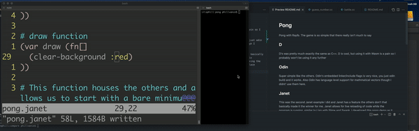
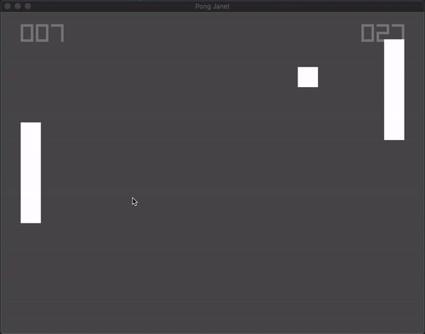

# Pong
Pong with Raylb. The game is so simple that there really isn't much to say
## D
D's was pretty much exactly the same as C++. D is cool, but using it with Wasm is a pain so I probably won't be using it any further
## Odin
Super simple like the others. Odin's embedded linker/include flags is very nice, you just odin build and it works. Also Odin has language level support for mathmatical vectors though I didnt' use them here. 
## Janet
This was the second Janet example I did and Janet has a feature the others don't that basically made it the winner for me. Janet allows for live reloading of code while the program is running, similar to Lisp with Slime and Swank. I developed this pong demo as it ran using the NeoVim with the Conjure Plugin as the editor and it was super fun. The changes take place instantly:

I included two files for Janet in this example. The first, `pong.janet` is the file I developed live and so it contains more comments and the scaffolding for live reloading, while the second `pong_final.janet` is the cleaned up file suitable for executable copilation via jpm.
## *Swift
Swift's version was nice like the others. Also Swift's seamless C interop was great, the only hiccup was that it didnt' understand Raylib's `#define` color macros so I had to alias them in the header file but not a big deal.

### compile times
ranked according to cached times
<table>
    <th>lang</th>
    <th>cached</th>
    <th>cold</th>
    <tr>
        <td>1. c++</td> 
        <td>0.441s</td>
        <td>0.506s</td>
    </tr>
    <tr>
        <td>2. swift</td> 
        <td>0.448s</td>
        <td>1.348s</td>
    </tr>
    <tr>
        <td>3. janet</td> 
        <td>0.492s</td>
        <td>1.276s</td>
    </tr>
    <tr>
        <td>4. D</td> 
        <td>0.543s</td>
        <td>0.597s</td>
    </tr>
    <tr>
        <td>5. odin</td> 
        <td>0.995s</td>
        <td>1.303s</td>
    </tr>
</table>

### demo
